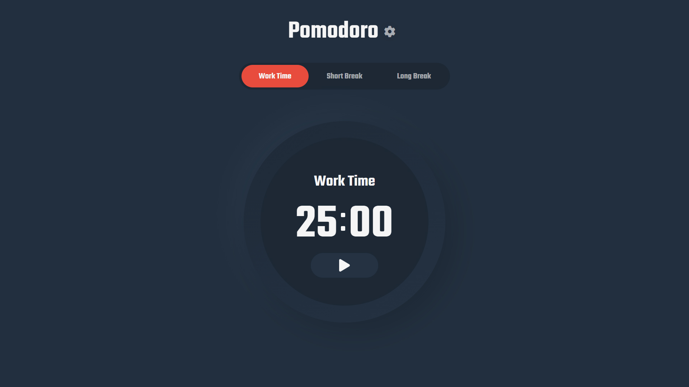
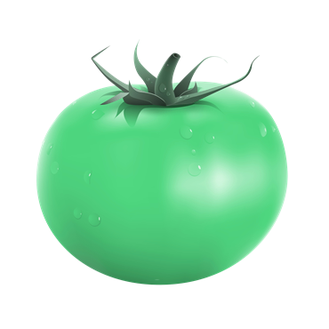
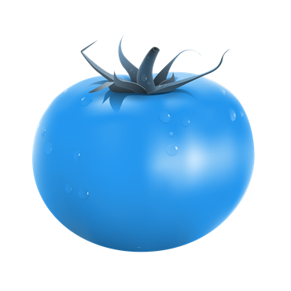
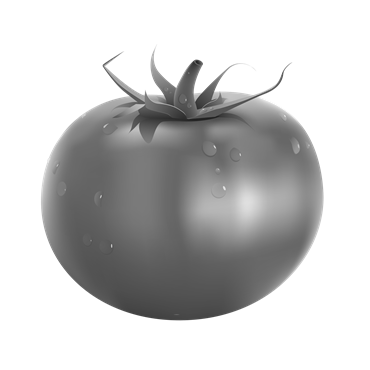

  

##

### Fonctionnalités : 

- Émet un signal sonore au début de chaque période.
- Affiche le timer dans l'onglet de la page.
- Change de couleur de la favicon en fonction de la période.  
  Work :  | Short :  | Long :  | Pomodoro terminé : 
- Permet choisir le temps en minutes de chaque période "Work", "Short" et "Long" via le bouton réglage à droite du titre.

##

### Cycle :

- 4 périodes de travail de 25 minutes (W) séparé de,
- 3 périodes de pause courte de 5 minutes (S) et terminant par,
- 1 période de pause longue de 15 minutes (L)

Soit : [ W - S - W - S - W - S - W - L ]

##

 

